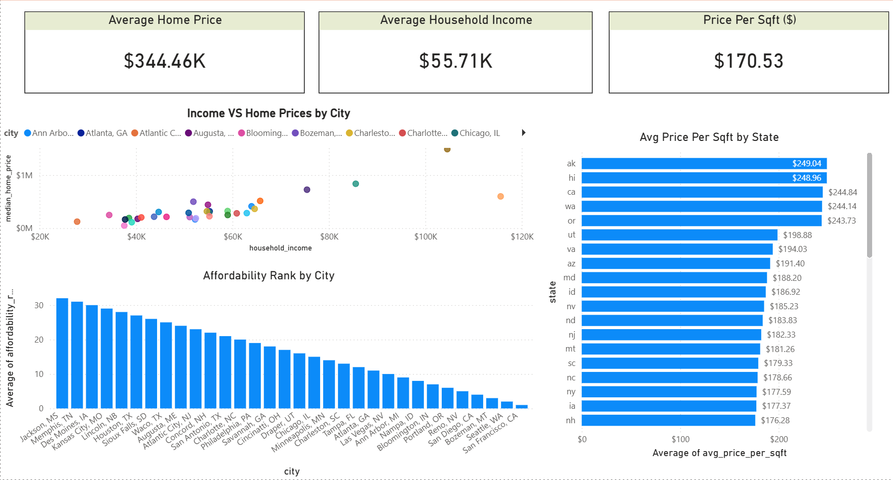

# Housing Market Analysis Dashboard 

## Overview
This Power BI dashboard analyzes housing affordability across U.S. cities using key metrics such as household income, home prices, and price per square foot. 
--
## Key Insights
- Higher income cities generally have higher home prices
- Price per square foot varies significantly by state
- Some cities show lower affordability despite moderate income

## Tools Used 
- Power BI
- PostgreSQL 
- EXCEL/ CSV Data
- Data visualization techniques

## Dashboard Preview
 

--
## Files Included 
- Power BI dashboard (.pbix)
- Dataset(s)
- SQL queries ('/sql/housing_analysis.sql')
- Dashboard screenshots 
